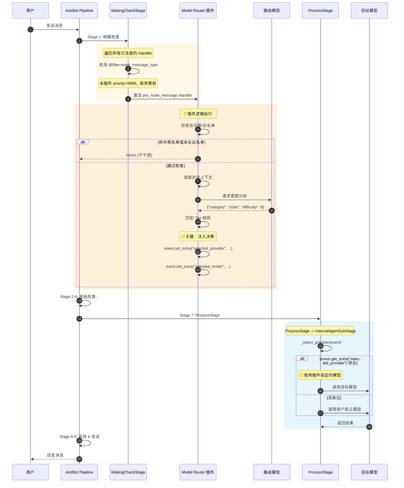

# AstrBot Plugin Model Router

**基于意图识别的智能多模型路由插件 / Intelligent Multi-Model Router based on Intent Recognition**

`astrbot_plugin_model_router` 是一个为 AstrBot 设计的高级插件，它能够拦截用户消息，利用一个快速的 "路由模型" (Router Model) 对用户意图进行分析和打分，然后根据任务的**难度 (Difficulty)** 和 **类别 (Category)** 自动将请求分发给最合适的模型。

实现 "简单问题用小模型（快/省），复杂问题用大模型（强/准）" 的最佳能效比。

## 📋 更新日志 (Changelog)

### v0.6.0 (2025-12-15)
- ✨ **任务快照系统**: 支持多任务上下文追踪，AI 可在多个活跃任务间智能选择延续哪个
- ✨ **多维度难度评分**: 针对 code/math/roleplay/chat 等不同维度提供独立的评分标准
- ✨ **上下文关系判断**: 新增 `context_relation` (continue/downgrade/unrelated) 和 `continued_task_id` 字段
- ✨ **轮数过期机制**: 快照有效期与 `context_turns` 配置挂钩，而非固定时间
- ✨ **可配置上下文长度**: 新增 `context_max_chars` 配置，允许自定义每条消息的最大字符数
- 🐛 **修复延续判断**: 强化 Prompt 规则，确保 continue/downgrade 时必须提供有效的 task_id

## ✨ 主要功能 (Features)

*   **🧠 智能意图识别**: 自动分析用户输入是闲聊、代码、角色扮演、数学问题还是其他自定义类别。
*   **⚖️ 难度分级路由**: 
    *   **🟢 Low Tier (1-3分)**: 简单问候、天气查询 -> 路由到轻量模型。
    *   **🟡 Mid Tier (4-6分)**: 常规逻辑、文案生成 -> 路由到标准模型。
    *   **🔴 High Tier (7-9分)**: 复杂推理、深度编程 -> 路由到高性能模型。
*   **📝 上下文感知**: 路由判断时会参考最近的对话历史，避免因上下文缺失导致的误判。
*   **🛡️ 会话黑/白名单**: 支持针对特定群组或用户开启/关闭路由功能。
*   **⚙️ 高度可配置**: 支持自定义分类规则、难度阈值、提示词模板。
*   **🐛 详细调试模式**: 实时查看路由器的思考过程、评分和分发结果。

## 📦 安装 (Installation)

1.  将此插件文件夹 `astrbot_plugin_model_router` 放入 AstrBot 的 `data/plugins/` 目录中。
2.  重启 AstrBot。
3.  在 AstrBot 管理面板中配置插件，或使用通过配置文件进行设置。

## ⚙️ 配置说明 (Configuration)

配置分为 **核心设置 (Core)**、**等级框架 (Tiers)** 和 **会话控制 (Session)** 三大部分。

### 1. 核心设置 (Router Config)

| 配置项 | 类型 | 默认值 | 说明 |
| :--- | :--- | :--- | :--- |
| `plugin_enabled` | bool | `true` | 插件总开关。 |
| `router_config.router_provider` | string | - | **(必须)** 负责分析意图的路由模型服务商。建议使用响应快、便宜的小模型。 |
| `router_config.router_model` | string | - | 指定路由使用的具体模型名称 (留空则用默认)。 |
| `router_config.debug_mode` | bool | `false` | 开启后，会在控制台或指定会话显示详细的路由分析日志。 |
| `router_config.context_turns` | int | `4` | 路由判断时参考的对话轮数 (1轮=一问一答)，同时控制任务快照的有效期。 |
| `router_config.context_max_chars` | int | `500` | 每条上下文消息的最大字符数。设置 0 表示不截断。 |

### 2. 等级框架 (Three Tiers)

插件将任务难度划分为三个等级，每个等级可以单独配置默认模型和特定分类的规则。

| 等级 | 适用场景 | 关键配置 |
| :--- | :--- | :--- |
| **🟢 Low Tier** | 闲聊、简单指令、单一工具调用 | **Max Score (默认3)**: 分数 <= 此值进入 Low Tier。 **Global Model**: 此等级的默认模型。 **Rules (r1-r6)**: 针对特定分类 (如 math, chat) 指定模型。 |
| **🟡 Mid Tier** | 一般逻辑、多步任务、文档摘要 | **Max Score (默认6)**: 分数 <= 此值 (且 > Low) 进入 Mid Tier。 **Global Model**: 此等级的默认模型。 |
| **🔴 High Tier** | 复杂代码、深度推理、创意写作 | **Global Model**: 此等级的默认模型 (通常配置为最强模型)。 **Rules (r1-r6)**: 同样可针对分类指定模型。 |

**规则 (Rules) 配置说明:**
每个 Tier 下可以配置 r1 到 r6 六组规则，每组规则包含：
*   `name`: 识别键名 (如 `code`)，对应路由模型分析出的 `category`。
*   `desc`: 意图定义 (如 `Programming tasks`)，会注入到路由模型的 Prompt 中。
*   `provider`: 命中该分类时使用的服务商。
*   `model`: 命中该分类时使用的模型名。

### 3. 会话控制 (Session Control)

| 配置项 | 说明 |
| :--- | :--- |
| `filter_type` | `blacklist` (黑名单模式) 或 `whitelist` (白名单模式)。 |
| `blacklist` | 黑名单列表，其中的 Session ID 将**跳过**路由，直接使用 AstrBot 全局默认模型。 |
| `whitelist` | 白名单列表，**只有**其中的 Session ID 会启用路由功能。 |

## 💻 指令 (Commands)

插件提供 `/router` 指令进行运行时管理：

| 指令 | 说明 | 示例 |
| :--- | :--- | :--- |
| `/router config` | 以表格形式显示当前的路由规则配置。 | `/router config` |
| `/router status` | 查看插件启用状态、当前路由模型等信息。 | `/router status` |
| `/router debug [on/off]` | 开启或关闭调试模式。不带参数则切换状态。 | `/router debug on` |
| `/router list` | 显示当前的黑/白名单列表。 | `/router list` |
| `/router add [sid]` | 将当前会话 (或指定SID) 添加到名单中。 | `/router add` |
| `/router remove [sid]` | 将当前会话 (或指定SID) 从名单中移除。 | `/router remove` |

---

## 🎨 技术实现 (Technical Implementation)

本插件深度集成 AstrBot 的 **Pipeline 架构** 和 **事件钩子系统**。下图和表格基于对 AstrBot 核心源码的分析。

### AstrBot Pipeline 阶段总览

AstrBot 使用洋葱模型处理消息，按顺序执行以下 9 个 Stage：

| # | Stage 名称 | 职责 |
|:---:|:---|:---|
| 1 | `WakingCheckStage` | 检查唤醒条件 (@ / wake_prefix)，**激活匹配的 Handler** |
| 2 | `WhitelistCheckStage` | 群聊/私聊白名单检查 |
| 3 | `SessionStatusCheckStage` | 会话启用状态检查 |
| 4 | `RateLimitStage` | 频率限制检查 |
| 5 | `ContentSafetyCheckStage` | 内容安全审核 |
| 6 | `PreProcessStage` | 预处理 |
| 7 | **`ProcessStage`** | **核心处理：调用插件 Handler 或 LLM** |
| 8 | `ResultDecorateStage` | 结果装饰 (T2I / 语音转换) |
| 9 | `RespondStage` | 发送消息 |

### 本插件的工作流程

### 关键代码对照表

| 阶段 | 插件代码 | AstrBot 核心代码 | 说明 |
|:---|:---|:---|:---|
| **Handler 注册** | `@filter.event_message_type(ALL, priority=9999)` | `star_handler.py` L246-258 | 注册到 `star_handlers_registry`，按 priority 排序 |
| **Handler 激活** | - | `waking_check/stage.py` L133-198 | `WakingCheckStage` 遍历 registry，执行 filter 匹配 |
| **注入决策** | `event.set_extra("selected_provider", id)` | - | 将目标模型 ID 写入 Event 对象 |
| **读取决策** | - | `internal.py` L69-79 `_select_provider()` | 优先读取 `selected_provider`，否则使用默认 |
| **Debug 输出** | `@after_message_sent()` | `star_handler.py` L529-540 | 注册 `OnAfterMessageSentEvent` 类型的 Handler |

### 核心机制解析

1.  **高优先级抢占**: `priority=9999` 确保本插件的 Handler 在 `WakingCheckStage` 遍历时排在最前面被激活。
2.  **数据注入点**: `event.set_extra()` 是 AstrBot 插件间通信的标准方式，本插件利用这一机制向后续 Stage 传递决策。
3.  **隐式接口**: `InternalAgentSubStage._select_provider()` 优先检查 `selected_provider` extra 数据，这是 AstrBot 预留的扩展点，本插件无需修改核心代码即可实现模型劫持。

---

### Tips
*   `Router Model` 应选择响应速度快的模型，以减少路由判断带来的延迟。
*   **Debugging**: 如果发现路由不准确，开启 `/router debug on`，观察 `reasoning` 字段，根据模型的思考过程微调配置中的 `desc` (意图定义)。
